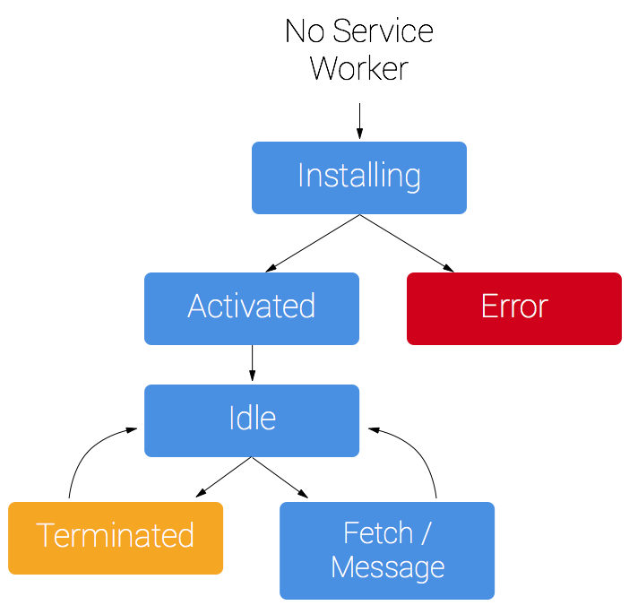

# service worker

一个service worker是一段运行在浏览器后台进程里面的脚本，它独立于页面，提供了那些不需要与web页面交互的功能，在网页背后悄悄执行的能力。基于它可以实现消息推送，静默更新以及地理围栏等服务。目前具备的功能：拦截和处理网络请求，包括可以编程的缓存管理。开发者可以完全控制离线数据，为用户带来非常好的离线体验。

**注意的地方：**
* 它是web worker，所以也是不能直接操作DOM的。（可以通过postMessage与页面通信，然后让页面自己操作DOM）
* 允许开发者控制页面上的网络请求
* 不被使用的时候会自己终止，当被再次调用的时候会被重新激活

**service worker的生命周期**
* sw拥有一个完全独立于web页面的生命周期
* 在网页中注册，注册之后浏览器会在后台默默启动sw的安装过程
* 安装中，会加载并缓存一些静态资源。如果缓存成功，sw安装成功。如果有任何加载或缓存失败，安装就失败，sw就不能被激活。
* 安装完成后，sw激活，这一阶段，还可以升级sw。
* 激活之后，sw将接管自己管辖域范围内的页面。如果一个页面刚注册sw，将会在该页面下一次加载的时候，sw才会生效。
* 接管页面之后，sw有两种状态：要么被终止（以节省内存），要么会处理fetch和message事件。

**sw注册**
> 
    if ('serviceWorker' in navigator) {
        navigator.serviceWorker.register('/sw.js').then(registration => {
            console.log('sw registration successful with scope: ', registration.scope)
        }).catch(error => {
            console.log('sw registration failed', error)
        })
    }

**sw安装**
> 
    const CACHE_NAME = 'my-sw-cache'
    const cacheList = [
        '/',
        '/xxx.css',
        '/yyy.js'
    ]
    self.addEventListener('install', function(event){
        event.waitUntil(
            caches.open(CACHE_NAME).then(cache => {
                return cache.addAll(cacheList)
            })
        )
    })

**sw缓存和返回request**
> 
    self.addEventListener('fetch', function(event){
        event.respondWith(
            caches.match(event.request).then(response => {
                if (response) return response
                let fetchRequest = event.request.clone()
                return fetch(fetchRequest).then(response => {
                    if (!response || response.status !== 200 || response.type !== 'basic') {
                        return response
                    }
                    let responseCache = response.clone()
                    caches.open(CACHE_NAME).then(cache => {
                        cache.put(event.request, responseCache)
                    })
                    return response
                })
            })
        )
    })

**sw更新**
> 
    self.addEventListener('activate', function(event){
        event.waitUntil(
            caches.delete(CACHE_NAME)
        )
    })

**相关文章**
* [【翻译】Service Worker 入门](https://www.w3ctech.com/topic/866)
* [使用 Service Workers](https://developer.mozilla.org/zh-CN/docs/Web/API/Service_Worker_API/Using_Service_Workers)