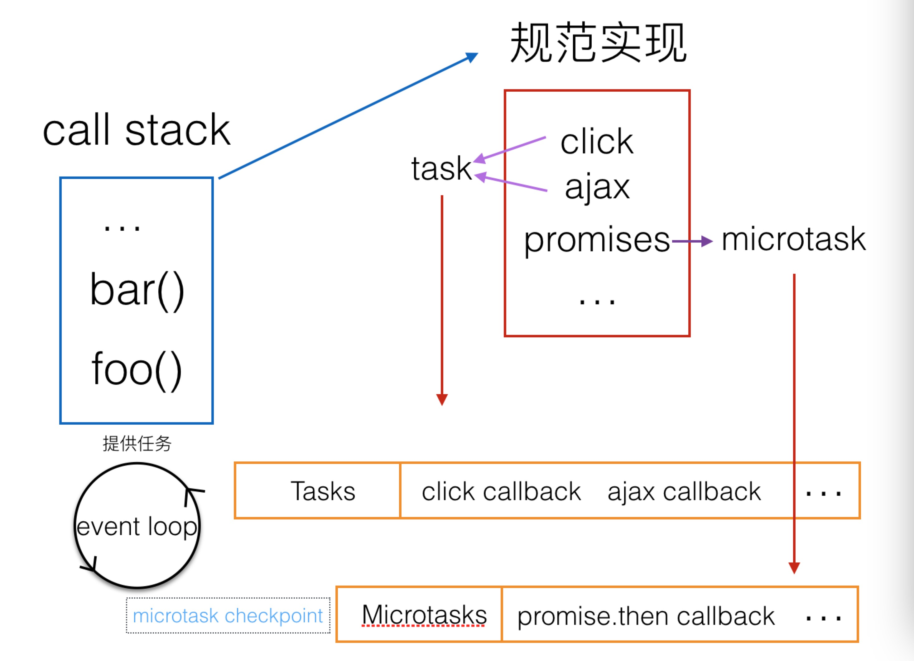

# event loop

**一些结论**
* 在一轮event loop中多次修改同一dom，只有最后一次会进行绘制。
* 渲染更新（Update the rendering）会在event loop中的tasks和microtasks完成后进行，但并不是每轮event loop都会更新渲染，这取决于是否修改了dom和浏览器觉得是否有必要在此时立即将新状态呈现给用户。如果在一帧的时间内（时间并不确定，因为浏览器每秒的帧数总在波动，16.7ms只是估算并不准确）修改了多处dom，浏览器可能将变动积攒起来，只进行一次绘制，这是合理的。
* 如果希望在每轮event loop都即时呈现变动，可以使用requestAnimationFrame。

**相关文章**
* [从event loop规范探究javaScript异步及浏览器更新渲染时机](https://github.com/aooy/blog/issues/5)
* [Tasks, microtasks, queues and schedules](https://jakearchibald.com/2015/tasks-microtasks-queues-and-schedules/)