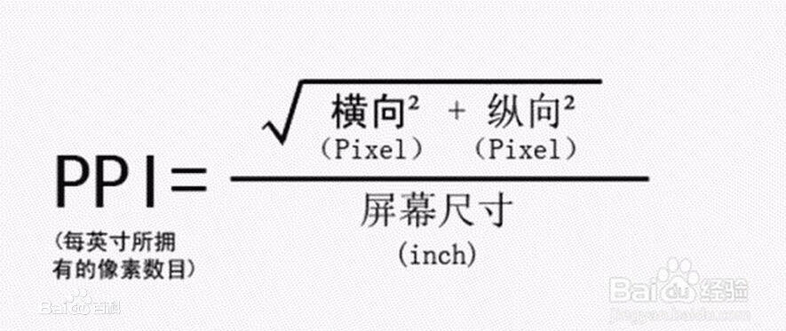

# viewport

屏幕像素密度，分辨率，屏幕尺寸的关系：

&lt;meta name="viewport" content="width=device-width, initial-scale=1.0, maximum-scale=1.0, user-scalabel=0"&gt;

其中设置width=device-width和initial-scale=1效果一样，都能将viewport设定为ideal viewport

<table>
    <tr><td>width</td><td>设置layout viewport的宽度，为一个正整数，或字符串"device-width"</td></tr>
    <tr><td>initial-scale</td><td>设置页面的初始缩放值，为一个数字，可以带小数</td></tr>
    <tr><td>minimum-scale</td><td>允许用户的最小缩放值，为一个数字，可以带小数</td></tr>
    <tr><td>maximum-scale</td><td>允许用户的最大缩放值，为一个数字，可以带小数</td></tr>
    <tr><td>user-scalable</td><td>是否允许用户进行缩放，值为"no"或"yes"，no代表不允许，yes代表允许</td></tr>
    <tr><td>height</td><td>设置layout viewport的高度，这个属性很少使用</td></tr>
</table>
安卓当中还支持 target-densitydpi 私有属性，表示目标设备的密度等级，作用是决定css中的1px代表多少物理像素 （安卓打算要废弃这个，要避免使用）
<table>
    <tr><td>target-densitydpi</td><td>值可以为一个数值或high-dpi、medium-dpi、low-dpi、device-dpi</td></tr>
</table>

**相关文章**
* [【全解析】屏幕尺寸，分辨率，像素，PPI之间到底什么关系？](http://www.chanpin100.com/article/20652)
* [移动前端开发之viewport的深入理解](http://www.cnblogs.com/2050/p/3877280.html)